<div align="center">

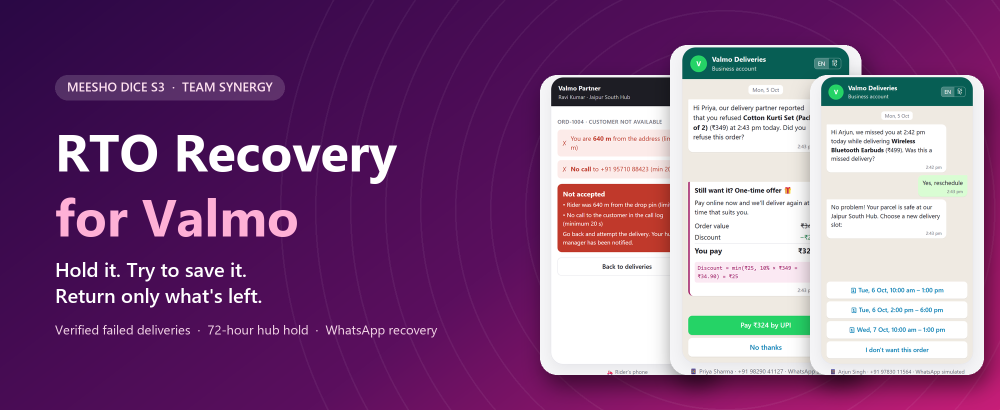

<br>

# RTO Recovery for Valmo

**No parcel enters the return queue until the system has tried to save it,<br>and it only tries once the failure is verified as real.**

<br>

<a href="https://valmo-rto.netlify.app/#/driver"></a>

<br><br>


<br>

[**Live demo**](https://valmo-rto.netlify.app/#/driver) ·
[The problem](#-the-problem) ·
[How it works](#-how-it-works) ·
[Scenarios](#-four-scenarios-end-to-end) ·
[Business rules](#-business-rules) ·
[Architecture](#-architecture) ·
[Run locally](#-run-it-locally)

</div>

---

## 🔗 Live demo

> ### **[valmo-rto.netlify.app](https://valmo-rto.netlify.app/#/driver)**
>
> Runs on any laptop or phone. **No login, no install.**
> Every visitor gets a private sandbox (stored in their own browser), so several people can use it at once without affecting each other.
> The **Reset demo** button restores the sample data.

| 🛵 Driver | 📱 Customer | 🏢 Hub Manager |
|:---:|:---:|:---:|
| [valmo-rto.netlify.app/#/driver](https://valmo-rto.netlify.app/#/driver) | [valmo-rto.netlify.app/#/customer](https://valmo-rto.netlify.app/#/customer) | [valmo-rto.netlify.app/#/hub](https://valmo-rto.netlify.app/#/hub) |

---

## 🎯 The problem

Return-to-Origin (RTO) is the single largest leak in Valmo's last mile: **1 in 6 parcels never reaches the customer.**

<table>
<tr>
<td align="center" width="25%"><h3>₹3,298 Cr</h3>RTO cost per year</td>
<td align="center" width="25%"><h3>194 Mn</h3>parcels returned per year</td>
<td align="center" width="25%"><h3>17%</h3>of all shipments</td>
<td align="center" width="25%"><h3>80%</h3>of RTO comes from two causes</td>
</tr>
</table>

Our diagnosis found that RTO isn't one problem. Two structural causes drive most of it, and **nothing today addresses either**:

| | Cause | Share of RTO | What goes wrong today |
|---|---|:---:|---|
| **1** | **Last-mile incentive gap** | **59%** · 115 Mn parcels | 120,000 gig riders are paid a flat rate regardless of difficulty. Nothing distinguishes a fake "customer not available" from a real attempt. |
| **2** | **Unrecovered refusals** | **21%** · 40 Mn parcels | A customer who refuses at the door (changed mind, found it cheaper) is sent straight back. No one tries to save the order. |

<sub>Figures are from our Round 2 diagnosis (case data, industry benchmarks and a 2025 GPS study). Recovery rates used below are working assumptions the pilot is designed to measure.</sub>

## 💡 The idea in one sentence

> Every **verified** delivery failure enters a **72-hour hold at the hub** instead of the return queue. An undelivered order gets a **reschedule offer**; a refused order gets **one capped second-chance offer**, gated by the customer's own history. **Only what's left unsaved after 72 hours actually returns.**

<details>
<summary><b>📊 See the proposal slide from our pitch deck</b></summary>
<br>
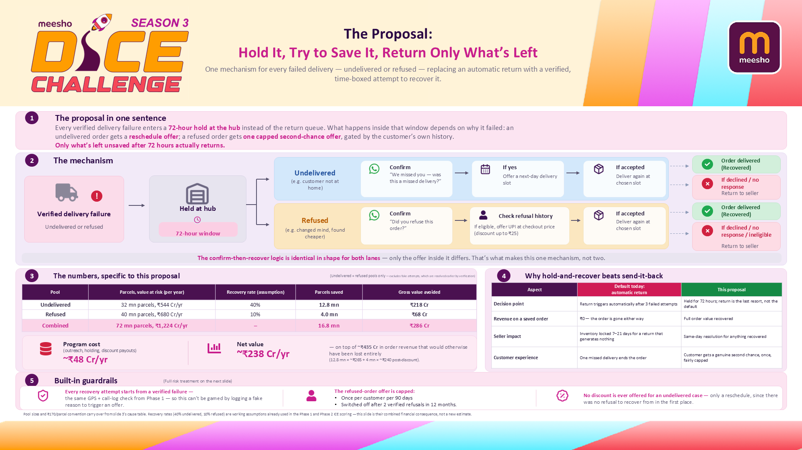
</details>

---

## ⚙️ How it works

One mechanism handles every failed delivery. Verification happens first, so the recovery flow can't be gamed.

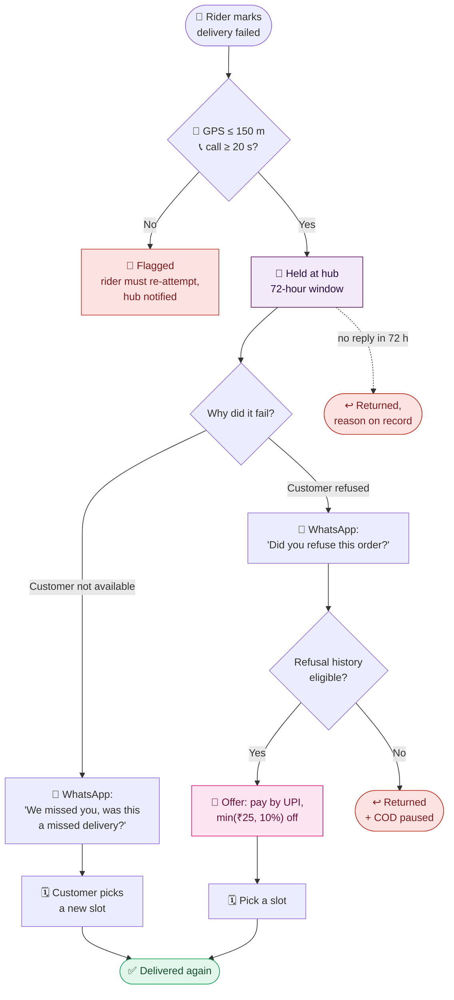
```mermaid
flowchart TD
    A(["🛵 Rider marks<br/>delivery failed"]) --> B{"📍 GPS ≤ 150 m<br/>📞 call ≥ 20 s?"}
    B -- "No" --> F["🚩 Flagged<br/>rider must re-attempt,<br/>hub notified"]
    B -- "Yes" --> H["🏢 Held at hub<br/>72-hour window"]
    H --> R{"Why did it fail?"}

    R -- "Customer not available" --> U1["💬 WhatsApp:<br/>'We missed you, was this<br/>a missed delivery?'"]
    U1 --> U2["🗓 Customer picks<br/>a new slot"]
    U2 --> D(["✅ Delivered again"])

    R -- "Customer refused" --> R1["💬 WhatsApp:<br/>'Did you refuse this order?'"]
    R1 --> R2{"Refusal history<br/>eligible?"}
    R2 -- "Yes" --> R3["🎁 Offer: pay by UPI,<br/>min(₹25, 10%) off"]
    R3 --> R4["🗓 Pick a slot"] --> D
    R2 -- "No" --> X(["↩️ Returned<br/>+ COD paused"])

    H -. "no reply in 72 h" .-> X2(["↩️ Returned,<br/>reason on record"])

    classDef good fill:#E3F6EC,stroke:#27A565,color:#14532D
    classDef bad fill:#FDE2E2,stroke:#C0392B,color:#7F1D1D
    classDef hold fill:#F2EAF8,stroke:#5B0F5E,color:#2A0845
    classDef offer fill:#FCE4F1,stroke:#E0187C,color:#6B0F3A
    class D good
    class F,X,X2 bad
    class H hold
    class R3 offer
```

### The recovery state machine

Every case moves through an explicit state machine, implemented in [`server/engine/recovery.js`](server/engine/recovery.js). Any action that isn't allowed in the current state is rejected, so **a case can never skip a step**.

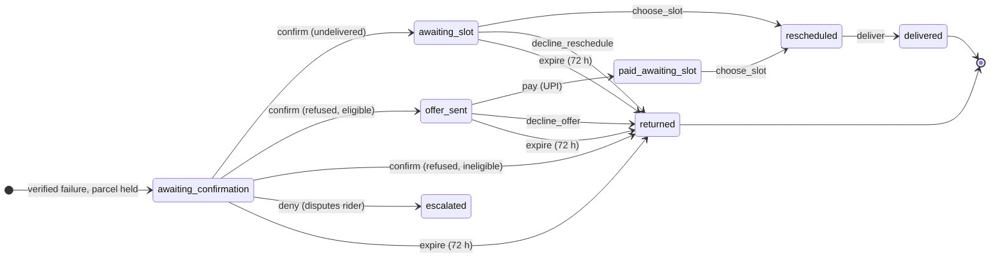
```mermaid
stateDiagram-v2
    direction LR
    [*] --> awaiting_confirmation : verified failure, parcel held
    awaiting_confirmation --> awaiting_slot : confirm (undelivered)
    awaiting_confirmation --> offer_sent : confirm (refused, eligible)
    awaiting_confirmation --> returned : confirm (refused, ineligible)
    awaiting_confirmation --> escalated : deny (disputes rider)
    awaiting_slot --> rescheduled : choose_slot
    awaiting_slot --> returned : decline_reschedule
    offer_sent --> paid_awaiting_slot : pay (UPI)
    offer_sent --> returned : decline_offer
    paid_awaiting_slot --> rescheduled : choose_slot
    rescheduled --> delivered : deliver
    awaiting_confirmation --> returned : expire (72 h)
    awaiting_slot --> returned : expire (72 h)
    offer_sent --> returned : expire (72 h)
    delivered --> [*]
    returned --> [*]
```

### Who sees what, and when

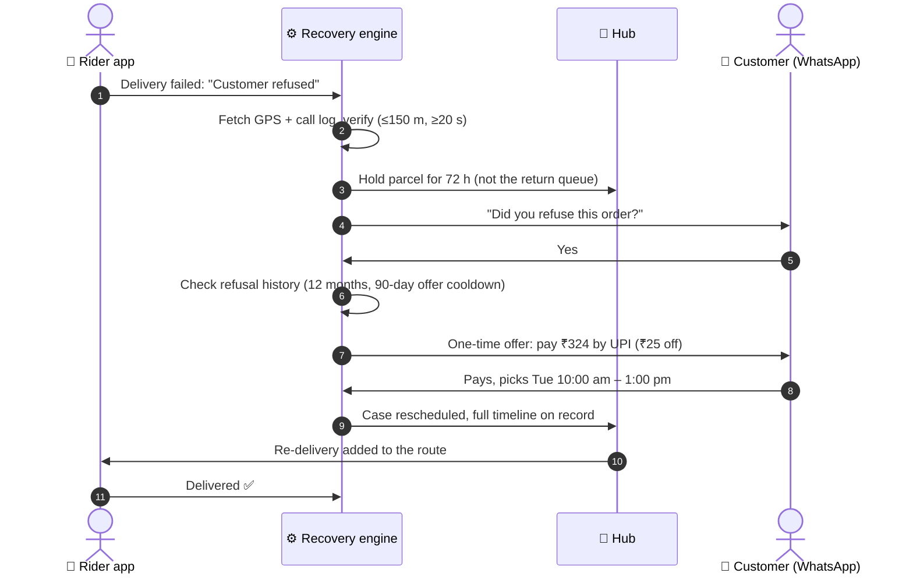
```mermaid
sequenceDiagram
    autonumber
    actor Rider as 🛵 Rider app
    participant E as ⚙️ Recovery engine
    participant H as 🏢 Hub
    actor C as 📱 Customer (WhatsApp)

    Rider->>E: Delivery failed: "Customer refused"
    E->>E: Fetch GPS + call log, verify (≤150 m, ≥20 s)
    E->>H: Hold parcel for 72 h (not the return queue)
    E->>C: "Did you refuse this order?"
    C->>E: Yes
    E->>E: Check refusal history (12 months, 90-day offer cooldown)
    E->>C: One-time offer: pay ₹324 by UPI (₹25 off)
    C->>E: Pays, picks Tue 10:00 am – 1:00 pm
    E->>H: Case rescheduled, full timeline on record
    H->>Rider: Re-delivery added to the route
    Rider->>E: Delivered ✅
```

---

## 👀 Three perspectives, one story

The prototype has three tabs that share the same live data, so what the rider does shows up for the customer and the hub manager straight away. After each action, a notification banner links to the view where the case continues.

<table>
<tr>
<th width="33%">🛵 Driver</th>
<th width="33%">📱 Customer</th>
<th width="33%">🏢 Hub Manager</th>
</tr>
<tr>
<td valign="top">The rider only says <b>why</b> a delivery failed. GPS and call log are read from the phone <b>automatically</b> and verified, so a failure can't be faked from the road. Re-deliveries appear here too.</td>
<td valign="top">Within about two minutes of a verified failure, the customer is asked on WhatsApp what happened. They confirm, pick a new slot, or accept / decline the second-chance offer. English and हिंदी.</td>
<td valign="top">Every held parcel with a live 72-hour countdown, the customer's refusal history, and a full timeline for each case. Nothing is returned without a reason on record.</td>
</tr>
<tr>
<td>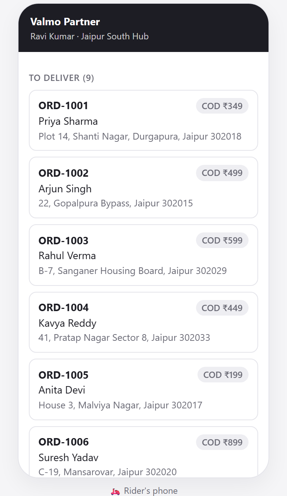</td>
<td>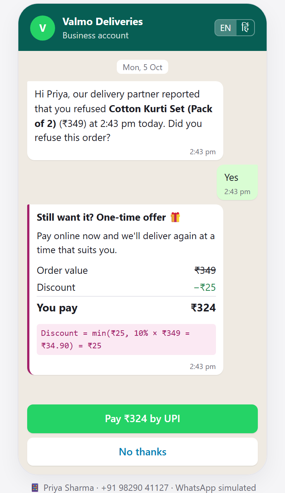</td>
<td>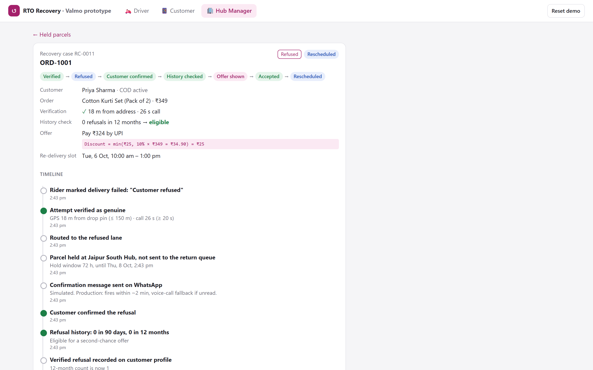</td>
</tr>
</table>

---

## 🎬 Four scenarios, end to end

The sample data covers every path through the mechanism. Each scenario starts from a different order on the Driver tab.

### A · A fake attempt is rejected &nbsp;`ORD-1004`

The rider reports *Customer not available*. Telemetry places the phone **640 m** from the address with **no call** to the customer, so the attempt is not accepted and the hub manager is notified. When the rider returns to the door and calls, the same report passes verification.

### B · Nobody home, so the delivery is rescheduled &nbsp;`ORD-1002`

The *Customer not available* report is verified (34 m from the address, 32 s call), so the parcel is **held** at the hub instead of returning. On WhatsApp, Arjun confirms the missed delivery and picks a new slot, and the parcel appears on the rider's *Re-deliveries* list.

<table>
<tr>
<td align="center" width="25%">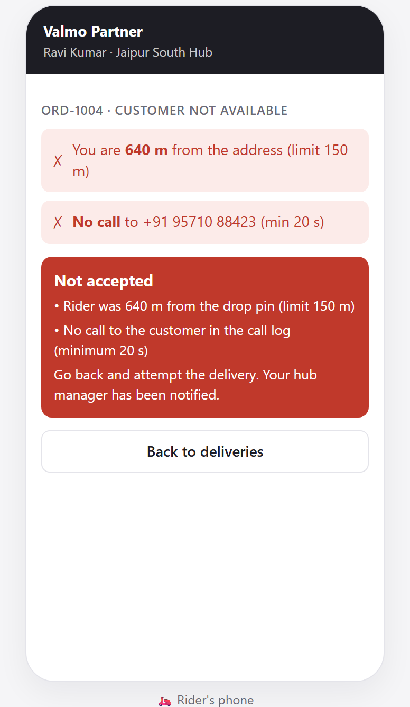<br><sub><b>A</b> · Not accepted: 640 m away, no call</sub></td>
<td align="center" width="25%">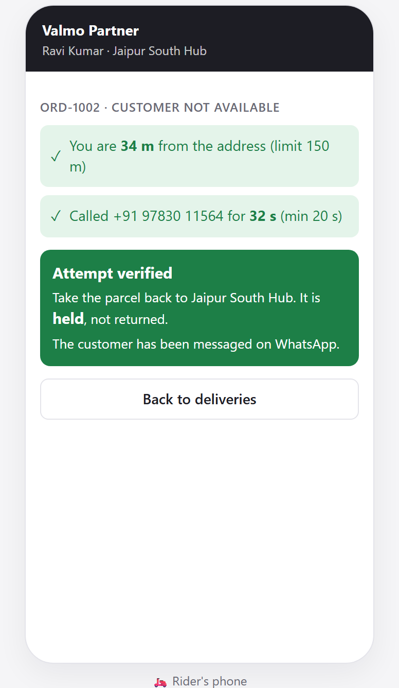<br><sub><b>B</b> · Verified, parcel held at hub</sub></td>
<td align="center" width="25%">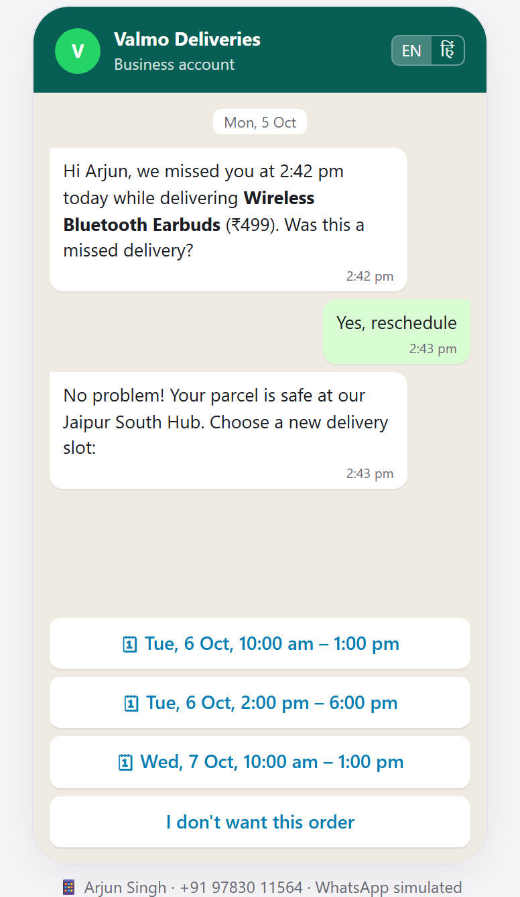<br><sub><b>B</b> · Customer picks a new slot</sub></td>
<td align="center" width="25%">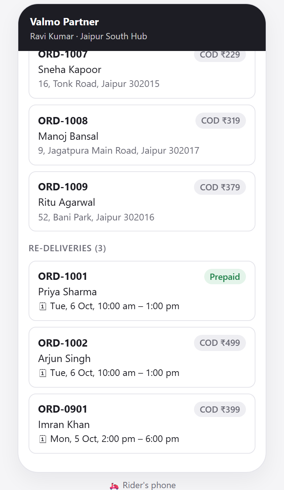<br><sub><b>B</b> · Back on the rider's route</sub></td>
</tr>
</table>

### C · A change of mind, recovered with an offer &nbsp;`ORD-1001`

Priya confirms she refused the order. It is her first verified refusal, so she receives a one-time offer of **min(₹25, 10% × ₹349) = ₹25 off**. She pays ₹324 by UPI, picks a slot, and the parcel is delivered the next day.

### D · A repeat refuser gets no offer &nbsp;`ORD-1003`

Rahul already has two verified refusals this year. His refusal is recorded, **no offer** is made, **Cash on Delivery is paused**, and the parcel returns with the reason on record in the Hub Manager view.

<table>
<tr>
<td align="center" width="25%">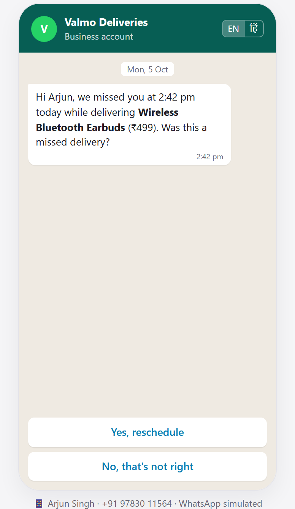<br><sub>The customer confirms first</sub></td>
<td align="center" width="25%"><br><sub><b>C</b> · One-time offer, formula shown</sub></td>
<td align="center" width="25%">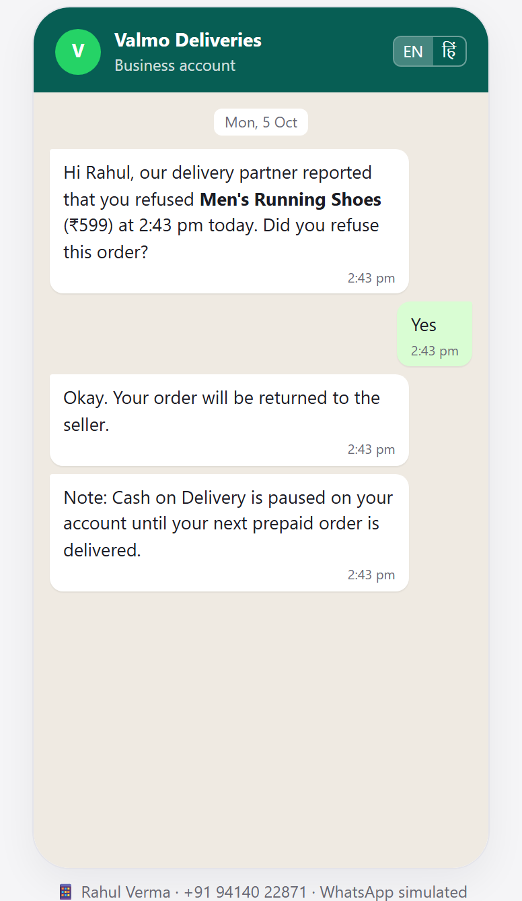<br><sub><b>D</b> · No offer, COD paused</sub></td>
<td align="center" width="25%">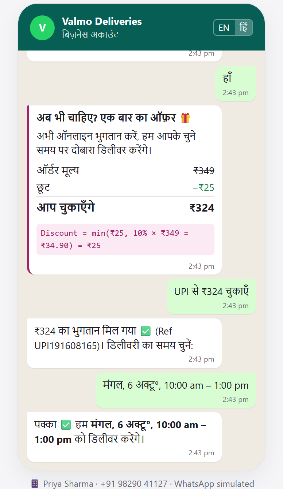<br><sub>Same flow in हिंदी</sub></td>
</tr>
</table>

### More ways riders try to game it (all caught)

| Order | The rider's trick | Caught by |
|---|---|---|
| `ORD-1004` | Never went to the door, never called | GPS **and** call log |
| `ORD-1007` | At the door, but never called | Call log |
| `ORD-1008` | Called from 1.8 km away, claimed "refused" | GPS |
| `ORD-1009` | Rang for 5 seconds and hung up | Call too short (< 20 s) |

**Edge cases in the sample data:** `ORD-1005` is a ₹199 order, so the 10% rule gives ₹19.90 off instead of ₹25. `ORD-1006`'s customer already used an offer last month, so the 90-day cooldown blocks a second one. A case with no customer reply returns after 72 hours with *No customer response* on record; a time-simulation control shows this without waiting.

### The hub manager's view

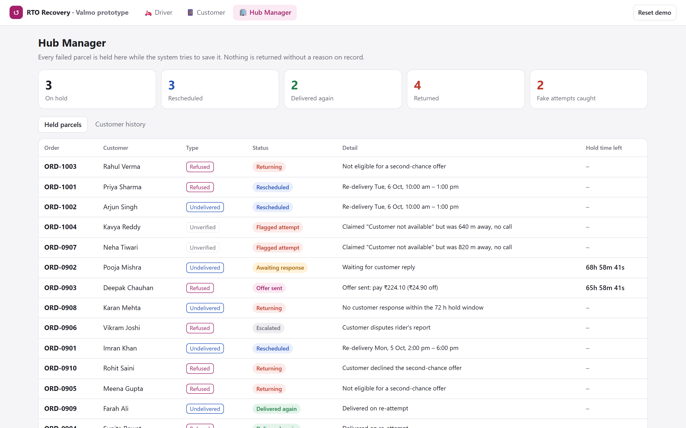

<details>
<summary><b>🔍 More screens: case timeline and customer history</b></summary>
<br>

**Every case keeps a full, timestamped timeline**, from the rider's report through verification, history checks, the offer and the outcome:


**Customer history** shows refusal counts in rolling 90-day and 12-month windows, offer eligibility and COD status. Test controls add or clear refusals, so the offer and COD guardrails can be exercised:

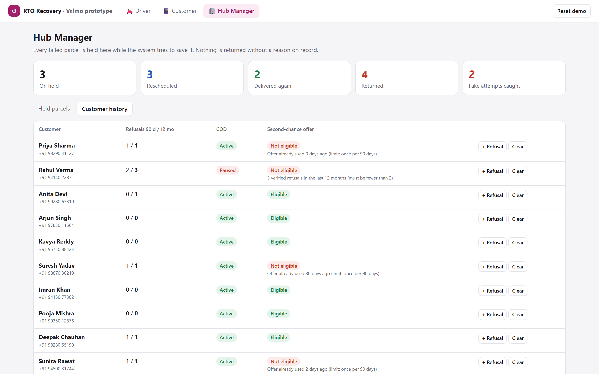

</details>

---

## 📏 Business rules

Every threshold lives in one file, [`server/config.js`](server/config.js), never inline in the logic.

| Rule | Value | Why |
|---|:---:|---|
| 📍 Rider must be within | **150 m** of the drop pin | Proves the rider actually went to the address |
| 📞 Outbound call to the customer must last | **≥ 20 s** | Proves a real attempt to reach them, not a 5-second ring |
| 🏢 Parcel is held at the hub for | **72 hours** | Time to recover it before it enters the return queue |
| 🎁 Second-chance discount | **min(₹25, 10% × order value)** | Recovering a parcel avoids a ~₹120 reverse-logistics leg, so ₹25 costs about a quarter of the saving |
| 🔁 Offer only if prior verified refusals in 12 months are | **fewer than 2** | Stops refusing from becoming a way to unlock discounts |
| ⏳ Offer at most once per | **90 days** | One fair second chance, not a habit |
| 💵 COD is paused when a refusal comes after | **2+ verified refusals in 12 months** | Re-enabled automatically after one prepaid order is delivered |
| 🚫 Undelivered orders get | **no discount ever** | There was no refusal to recover from, only a reschedule |

---

## 🏗 Architecture

The prototype has **zero dependencies**: plain Node.js on the server and vanilla ES modules in the browser. The same engine runs in two modes.

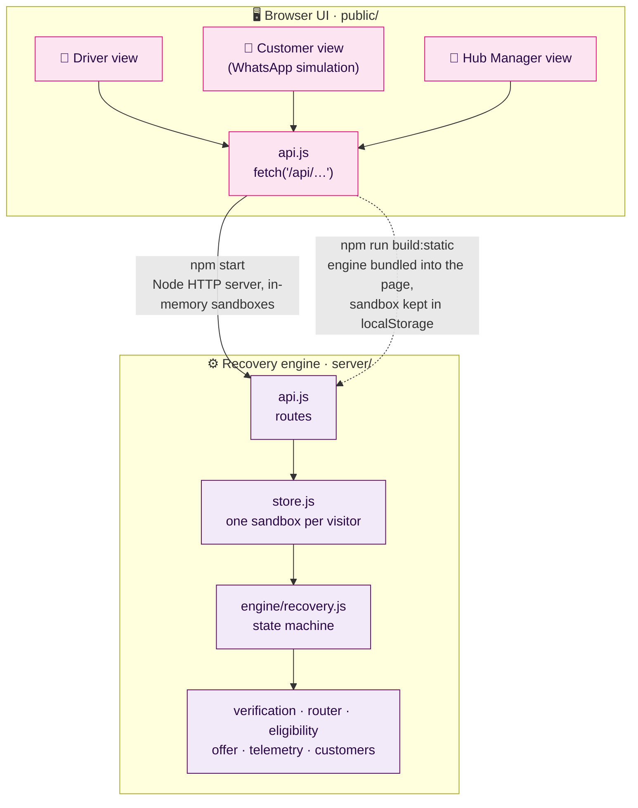
```mermaid
flowchart TB
    subgraph UI["🖥 Browser UI · public/"]
        V1["🛵 Driver view"]
        V2["📱 Customer view<br/>(WhatsApp simulation)"]
        V3["🏢 Hub Manager view"]
        API["api.js<br/>fetch('/api/…')"]
        V1 & V2 & V3 --> API
    end

    subgraph ENGINE["⚙️ Recovery engine · server/"]
        ROUTES["api.js<br/>routes"]
        STORE["store.js<br/>one sandbox per visitor"]
        REC["engine/recovery.js<br/>state machine"]
        MODS["verification · router · eligibility<br/>offer · telemetry · customers"]
        ROUTES --> STORE --> REC --> MODS
    end

    API -- "npm start<br/>Node HTTP server, in-memory sandboxes" --> ROUTES
    API -. "npm run build:static<br/>engine bundled into the page,<br/>sandbox kept in localStorage" .-> ROUTES

    classDef ui fill:#FCE4F1,stroke:#E0187C,color:#2A0845
    classDef eng fill:#F2EAF8,stroke:#5B0F5E,color:#2A0845
    class V1,V2,V3,API ui
    class ROUTES,STORE,REC,MODS eng
```

| Mode | Command | What runs | Used for |
|---|---|---|---|
| **Server** | `npm start` | Node HTTP server; each browser gets an in-memory sandbox | Local development, testing on a phone over the local network |
| **Static** | `npm run build:static` | The *unchanged* `server/` modules bundled into `dist/js/engine.bundle.js`; a small shim answers `fetch('/api/…')` in the browser and keeps the sandbox in `localStorage` | The public link on Netlify. No server, never sleeps |

### What's real and what's simulated

| ✅ Real logic (in `server/engine/`) | 🎭 Simulated |
|---|---|
| GPS distance + call-duration verification | Rider phone telemetry (scripted per order in `seed.json`) |
| Undelivered vs. refused lane routing | WhatsApp messaging |
| 90-day / 12-month refusal counting | UPI payment |
| Discount cap and offer cooldown | Reverse logistics |
| COD pause and automatic resume | |
| 72-hour hold expiry | |
| A state machine that rejects out-of-order steps | |

### API

| Method | Endpoint | Does |
|---|---|---|
| `GET` | `/api/state` | Full snapshot for the visitor's sandbox (polled every 2 s) |
| `POST` | `/api/attempts` | Rider reports a failed delivery `{ order_id, reason }`; GPS + call log are fetched and verified server-side |
| `POST` | `/api/cases/:id/actions` | Customer / ops action: `confirm`, `deny`, `choose_slot`, `decline_reschedule`, `pay`, `decline_offer`, `deliver`, `expire` |
| `POST` | `/api/customers/:id/refusals` | Test control: adds a verified refusal to a customer |
| `POST` | `/api/customers/:id/clear` | Test control: clears a customer's refusal history |
| `POST` | `/api/reset` | Restores all sample data for this visitor |

### Project structure

```
├── package.json            npm start · npm run build:static
├── netlify.toml            optional: auto-deploy dist/ from this repo
├── scripts/
│   └── build-static.js     builds the static, serverless copy into dist/
├── server/
│   ├── index.js            HTTP server (static files + JSON API)
│   ├── api.js              API routes
│   ├── store.js            one in-memory sandbox per visitor
│   ├── config.js           every threshold (150 m, 20 s, 72 h, ₹25 / 10%, …)
│   ├── engine/
│   │   ├── telemetry.js    simulated rider GPS + call log (auto-fetched)
│   │   ├── verification.js GPS + call-log check
│   │   ├── router.js       undelivered vs. refused lane
│   │   ├── eligibility.js  refusal history & offer eligibility
│   │   ├── offer.js        discount calculation + UPI link
│   │   ├── recovery.js     the recovery state machine
│   │   └── customers.js    test edits to refusal history
│   ├── lib/                geo, formatting, errors
│   └── data/
│       ├── seed.json       orders (with telemetry), customers, hubs
│       └── seed.js         replays seeded history through the real engine
├── public/
│   ├── index.html          navbar: Driver · Customer · Hub Manager
│   ├── css/style.css
│   └── js/
│       ├── app.js          router + cross-view notifications
│       ├── api.js, store.js, ui.js, i18n.js (EN / हिं)
│       ├── components/     chat.js (WhatsApp), casePanel.js (case timeline)
│       └── views/          driver.js, customer.js, hub.js
└── docs/images/            screenshots used in this README
```

---

## 🚀 Run it locally

Requires **Node.js 18+** and nothing else: there are zero dependencies.

```bash
git clone https://github.com/S-Raha23/Valmo_RTO_Meesho.git
cd Valmo_RTO_Meesho
npm start
```

The app runs at **http://localhost:3000**, and the terminal also prints a network address for phones on the same Wi-Fi.

### Static build

```bash
npm run build:static        # writes dist/
```

`dist/` is a self-contained static site that any static host can serve. [valmo-rto.netlify.app](https://valmo-rto.netlify.app) is hosted on Netlify; `netlify.toml` holds the build command and publish folder for repository-linked deploys. Asset paths are relative, so the build also works from a sub-path such as GitHub Pages.

---

## 🗺 From prototype to rollout

The prototype is the foundation of a gated 90-day pilot. Nothing scales until its own numbers clear.

| Stage | What launches | Gate to proceed |
|---|---|---|
| **Day 0–30** · Prove the foundation | GPS + call-log verification and the 72-hour hold, in 3 pin-code clusters in one city | NDR rejection rate > 10% · RTO down ≥ 2 pp · *pause if rider attrition exceeds control by > 15%* |
| **Day 31–60** · Extend recovery | Reschedule offer (undelivered) and capped second-chance offer (refused); expand to metro, Tier-2, Tier-3 | Undelivered recovery ≥ 30% · offer acceptance ≥ 5% · refusal rate flat against holdout |
| **Day 61–90** · Refine at scale | Tune thresholds, offer, scripts; no new solutions | Day-60 gains hold in all 3 cities · cost per RTO prevented ≤ ₹50 · rider earnings flat or up |

<details>
<summary><b>📊 See the one-page summary and rollout slides from our pitch deck</b></summary>
<br>
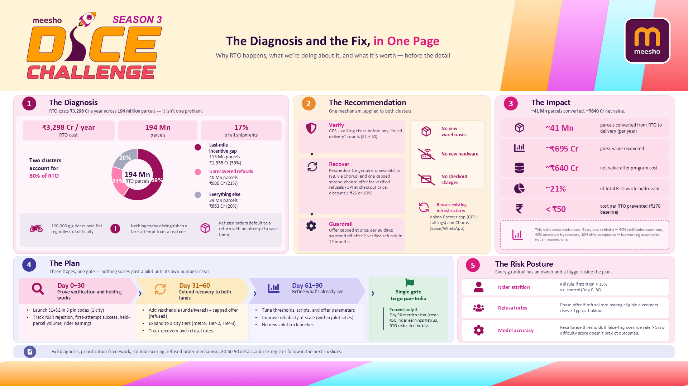
<br><br>
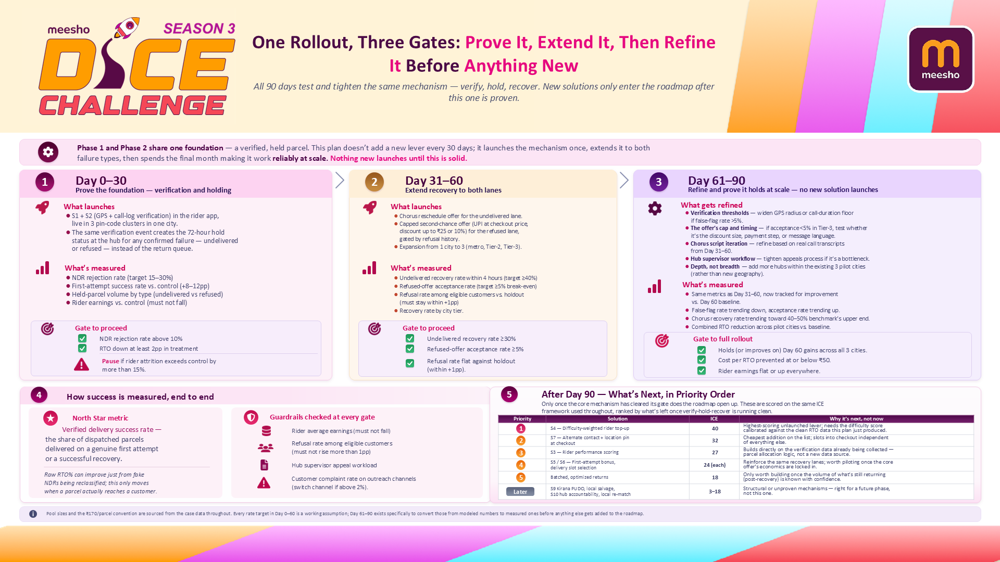
</details>

---

<div align="center">

### 👥 Team Synergy

**Soubhagya Raha** · **Laksh Bansal** · **Lipi Khandelwal**

Built for **Meesho DICE Challenge, Season 3** · Problem track: *Reducing RTO: getting more orders delivered*

<br>

<a href="https://valmo-rto.netlify.app/#/driver"></a>

</div>
